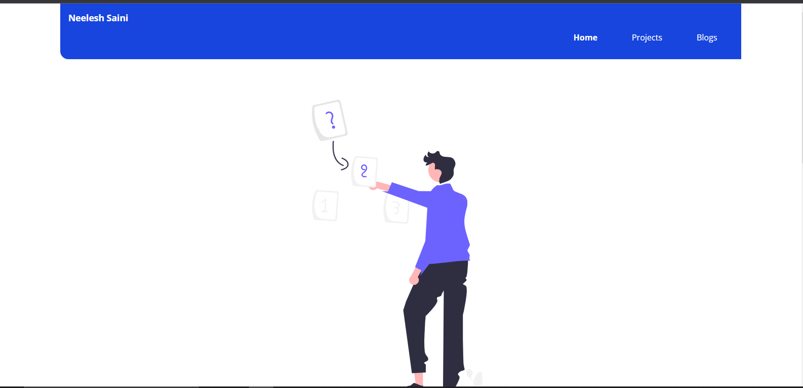

# My Portfolio Website
This is my portfolio website which showcase all my learnings and the apps which I made as part of neog camp.
## Technologies used:
  * HTML5
  * CSS3
 ## Hosted on
 Netlify
 ## Website Link
 https://neelesh-saini.netlify.app/
 ## Description
 This portfolio has a home page with an introduction, projects page, Blogs page and footer with social media handles.

It has a navigation bar to navigate to the pages.

Projects are listed in the projects section which contains links of live project and source code of each project.

Blogs page containe 2 blogs.

Website is responsive.

### Home page

